### reference for things i've made in vvvv

#### parasitic design tutorial series

| P_1_0 Hello Color  |
| :---: |
| <a href="https://github.com/pussinboot/learning-vvvvv/tree/master/parasitic_redesign/P_1_0%20Hello%20Color">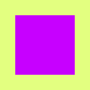</a> |

| P_1_1_1 Color Spectrum in a Grid | P_1_1_2 Color Spectrum in a Circle |
| :---: | :---: |
| <a href="https://github.com/pussinboot/learning-vvvvv/tree/master/parasitic_redesign/P_1_1_1%20Color%20Spectrum%20in%20a%20Grid">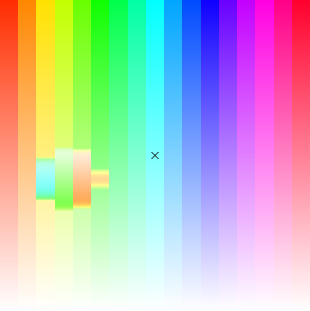</a> | <a href="https://github.com/pussinboot/learning-vvvvv/tree/master/parasitic_redesign/P_1_1_2%20Color%20Spectrum%20in%20a%20Circle">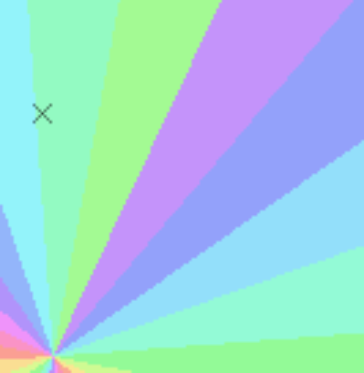</a> |

| P_1_2_3_01 Color Palettes out of Rules |
| :---: |
| <a href="https://github.com/pussinboot/learning-vvvvv/tree/master/parasitic_redesign/P_1_2_3_01%20Color%20Palettes%20out%20of%20Rules">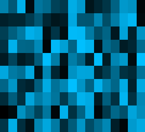</a> |

| P_2_0_01 Hello Shape |
| :---: |
| <a href="https://github.com/pussinboot/learning-vvvvv/tree/master/parasitic_redesign/P_2_0_01%20Hello%20Shape">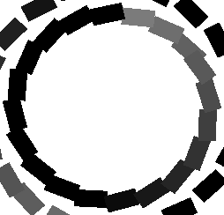</a> |

| P_2_1_1_01 Arrangement in a Grid | P_2_1_2_01 Displacement in a Grid | P_2_1_3_01 Complex module in a Grid |
| :---: | :---: | :---: |
| <a href="https://github.com/pussinboot/learning-vvvvv/tree/master/parasitic_redesign/P_2_1_1_01%20Arrangement%20in%20a%20Grid">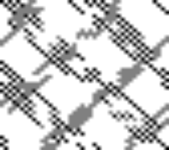</a> | <a href="https://github.com/pussinboot/learning-vvvvv/tree/master/parasitic_redesign/P_2_1_2_01%20Displacement%20in%20a%20Grid">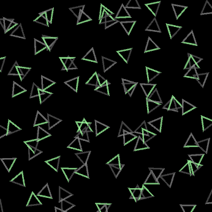</a> | <a href="https://github.com/pussinboot/learning-vvvvv/tree/master/parasitic_redesign/P_2_1_3_01%20Complex%20module%20in%20a%20Grid">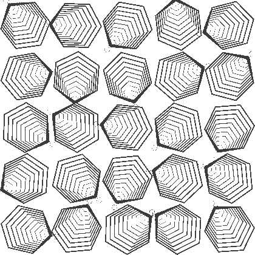</a> 

| P_2_2_1_01 Stupid Agent | P_2_2_5_01 Density structure of Agents |
| :---: | :---: |
| <a href="https://github.com/pussinboot/learning-vvvvv/tree/master/parasitic_redesign/P_2_2_1_01%20Stupid%20Agent">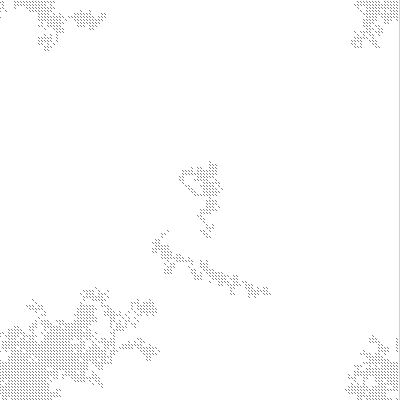</a> | <a href="https://github.com/pussinboot/learning-vvvvv/tree/master/parasitic_redesign/P_2_2_5_01%20Density%20structure%20of%20Agents">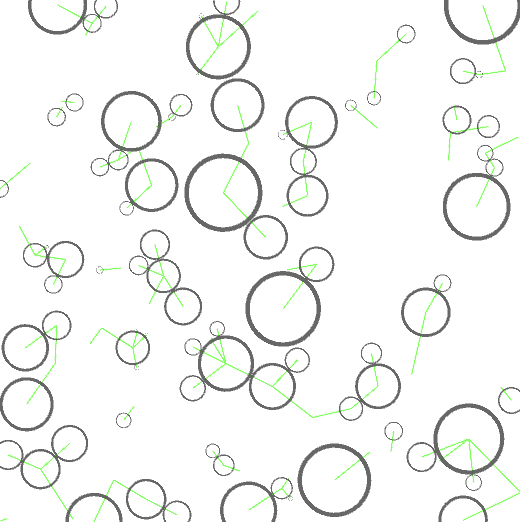</a> |

| P_2_3_4_01 Drawing with elastic Brush |
| :---: |
| <a href="https://github.com/pussinboot/learning-vvvvv/tree/master/parasitic_redesign/P_2_3_4_01%20Drawing%20with%20elastic%20Brush">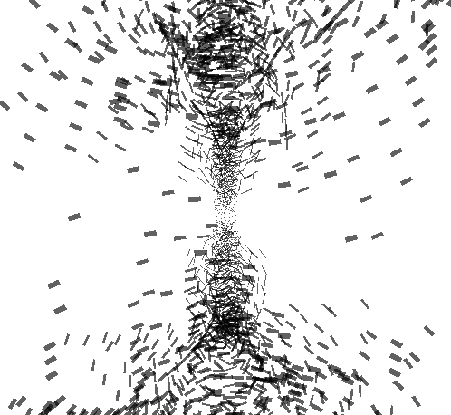</a> |
| P_4_1_1_01 Image Details in the Grid |
| :---: |
|  |